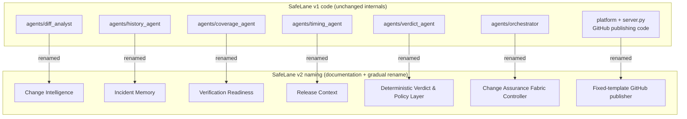
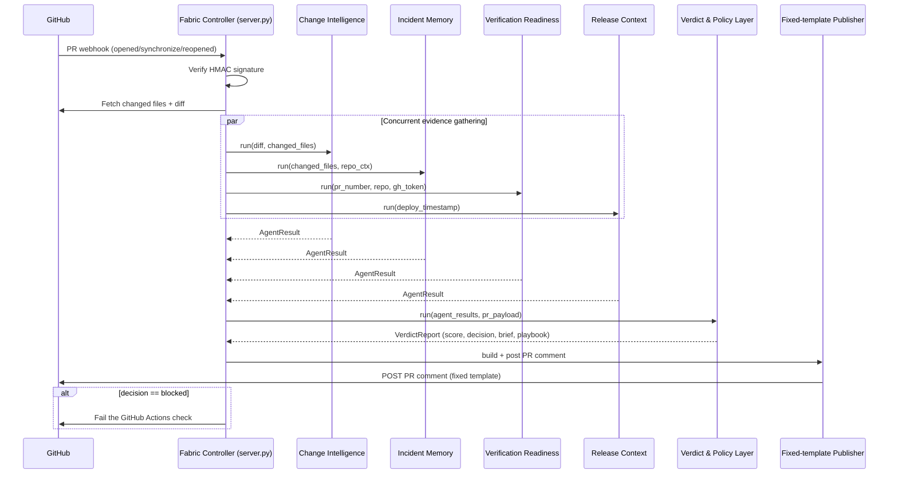

# SafeLane v2 — Architecture

**Companion files:** `02_Product_Requirements_Document.md`, `04_System_Design.md`, `08_Code_Integration_Map.md`

---

## 1. The SafeLane Change Assurance Fabric

The **Change Assurance Fabric** is SafeLane's product architecture: the coordinated set of stages that turn a raw GitHub PR event into a trustworthy, explained decision. It is implemented today by `agents/orchestrator/` (the **Fabric Controller**) and `agents/orchestrator/server.py` (the FastAPI webhook/HTTP surface).

Required component tree (as specified — read this as ownership/composition, not strict execution order):

```text
SafeLane Change Assurance Fabric
        |
        +-- Fixed-template GitHub publisher
                |
                +-- Evidence modules
                        |
                        +-- Change Intelligence
                        +-- Incident Memory
                        +-- Verification Readiness
                        +-- Release Context
```

The **actual runtime order** (see §5, Orchestration Flow) is: the Fabric Controller runs the four Evidence Modules concurrently *first*, hands their results to the Deterministic Verdict & Policy Layer, and only then invokes the Fixed-template GitHub publisher to post the result. The tree above expresses that the publisher is the Fabric's single GitHub-facing output surface, and that the four modules are the evidence it publishes — not that the publisher runs before the modules.

## 2. The Fixed-template GitHub publisher

**What it is:** the *only* code path allowed to write to GitHub on SafeLane's behalf. It never lets model output directly choose GitHub actions, permissions, or command text — it fills a fixed markdown/YAML template with structured data.

Two concrete implementations exist today:

1. **PR comment publisher** — `agents/orchestrator/server.py::_build_pr_comment()` + `_post_pr_comment()`. Builds a fixed-structure markdown comment (score, tag, status table, collapsible risk brief, collapsible rollback playbook) from a `VerdictReport`, then posts it via the GitHub REST API.
2. **Workflow installer** — `platform/server/services/github_service.py::WORKFLOW_TEMPLATE` + `commit_workflow_file()`. A fixed GitHub Actions YAML template (parameterized only by the orchestrator URL) is committed into a customer repo's `.github/workflows/` directory via the GitHub Contents API. The workflow itself (`actions/github-script`) also builds its PR comment from a fixed JS template — same principle, embedded closer to the customer's CI run.

Both implementations already satisfy the core trust requirement: **the model can generate words, never actions.** The score, decision, and any git commands shown are produced by deterministic code and inserted into a template — the LLM (when used) only helps phrase the *findings/brief text* around them.

## 3. The Four Evidence Modules

| Evidence module | Backing code | What it evaluates | External dependency |
|---|---|---|---|
| **Change Intelligence** | `agents/diff_analyst/` | Diff text for hardcoded secrets, removed error handling, removed retry/backoff/timeout logic, risky schema/migration changes | Optional Azure OpenAI (heuristics always run first, deterministically) |
| **Incident Memory** | `agents/history_agent/` + `mcp_servers/azure_mcp_server/` | Correlates changed files against past production incidents via Azure AI Search, using strict exact-path/basename/stem matching | Optional Azure AI Search (reports "no deployment connection" cleanly if absent) |
| **Verification Readiness** | `agents/coverage_agent/` | Whether changed Python files have a conventionally-named test file; whether test files were deleted; nudges GitHub Copilot to write missing tests | GitHub REST API (required — this module needs a GitHub token to check file existence) |
| **Release Context** | `agents/timing_agent/` | Deploy-window risk from day-of-week, time-of-day, US federal holiday proximity, and release-date proximity | None — pure deterministic datetime logic, always available |

Every module returns the same shape (`AgentResult` — see `04_System_Design.md` §2 for the full schema), which is what makes true parallel dispatch possible: the Fabric Controller doesn't need module-specific handling to aggregate results.

## 4. Relationship Between Existing Code and Renamed Architecture



Nothing in this mapping requires a rewrite. It is a documentation- and naming-first change; see `08_Code_Integration_Map.md` for exactly which files get renamed vs. left alone.

## 5. Orchestration Flow (actual runtime sequence)



Key resilience property already in the code: each evidence-module call is wrapped in `asyncio.wait_for(..., timeout=30)` inside `asyncio.gather(..., return_exceptions=True)`. A crashed or slow module never takes down the pipeline — it's replaced with a conservative `warning` fallback result (`agents/orchestrator/__init__.py::_make_fallback`).

## 6. GitHub Integration

- **Inbound:** `POST /webhook/pr` (HMAC-verified) or the self-installed Actions workflow calling `POST /analyze` directly.
- **Registration lookup:** every inbound event resolves a `RepoContext` (owner, repo, decrypted PAT, optional Azure Search config) from the Setup Platform's database (`platform/server/services/db.py::RegistrationRow`). No registration → request is rejected (404), so SafeLane never analyzes a repo it wasn't explicitly connected to.
- **Outbound:** GitHub REST API calls for fetching PR files/diff, checking test-file existence, and posting comments — all made with the registration's stored PAT, scoped to that repo only.
- **Workflow installation:** one-time, via the Setup Platform, using the GitHub Contents API (with an empty-repo bootstrap path using the low-level Git Data API when needed).

## 7. The Setup Platform

`platform/` is a **deliberately independent** FastAPI application (see `platform/server/app.py` docstring: *"zero imports from agents/, mcp_servers/, or foundry/"*). It only knows the orchestrator as an external URL. Responsibilities:

- GitHub OAuth login + PAT validation (`routers/auth.py`, `routers/github_setup.py`)
- Workflow file installation into the customer repo (fixed template)
- Azure OAuth + Log Analytics workspace selection (`routers/azure_setup.py`)
- Registration CRUD, encrypted PAT storage (`routers/registrations.py`, `services/auth_service.py`)
- Serves the static setup-wizard frontend (`platform/frontend/`)

This separation is a genuine architectural asset worth preserving in v2: it means the Fabric Controller can be redeployed, scaled, or even swapped without touching customer onboarding, and vice versa.

## 8. Data Flow (end to end)

1. Setup Platform stores an encrypted PAT + (optional) Azure workspace binding as a `RegistrationRow`.
2. GitHub sends a PR webhook to the Fabric Controller.
3. Fabric Controller resolves the `RegistrationRow` → builds a `RepoContext` (decrypts the PAT in-memory only).
4. Fabric Controller fetches the diff/changed files using that PAT.
5. Evidence Modules run concurrently against the `PRPayload` + `RepoContext`.
6. Verdict & Policy Layer combines `AgentResult`s into a `VerdictReport`.
7. (Optional) Foundry policy guardrails annotate the verdict with an audit entry and escalation flag.
8. Fixed-template Publisher posts the verdict to the PR and fails the check if blocked.
9. (Background, separate pipeline) Azure Functions periodically ingest new production incidents from Log Analytics/Monitor alerts into the per-repo Incident Memory index, so future PRs benefit from fresher history.

## 9. Security Boundary

- **Trust boundary:** PR title/body/comments/branch names/diff content are contributor-controlled and must be treated as *data*, never as *instructions* — to SafeLane's own code or to any LLM prompt it constructs. This is enforced today only informally (system prompts describe the diff as "diff text to analyze"); v2 adds an explicit, deterministic **Security Preflight** stage to make this boundary enforceable and testable (full spec in `04_System_Design.md` §7).
- **Least privilege:** each registration's PAT is scoped to the one repo it was registered for; SafeLane never requests org-wide or account-wide access beyond what the user's PAT already grants.
- **No model authority over GitHub:** enforced structurally — the only code that calls GitHub's write endpoints is the Fixed-template Publisher, and it only accepts a `VerdictReport` (a validated Pydantic model with enforced invariants — see `04_System_Design.md` §2) as input.
- **Secrets at rest:** PATs are Fernet-encrypted (`ENCRYPTION_KEY`); the encryption key itself must never be committed. JWT session tokens are signed (`JWT_SECRET`).
- **Webhook integrity:** HMAC-SHA256 signature verification against `GITHUB_WEBHOOK_SECRET` before any payload is parsed.

## 10. Model and Non-Model Components

| Layer | Model-touching? | Notes |
|---|---|---|
| Heuristic diff scan (Change Intelligence) | No | Regex-based, deterministic, always runs first |
| LLM diff enrichment (Change Intelligence) | Yes, optional | Only adds/refines `findings`/`recommended_action` text; heuristic `critical` findings are never downgraded by the LLM |
| Incident Memory | No (search, not generation) | Azure AI Search ranking is retrieval, not generation |
| Verification Readiness | No | Pure GitHub API + path-convention checks |
| Release Context | No | Pure datetime logic |
| Verdict scoring & decision | **No, never** | `score = 100 − Σ(modifier × weight)`; decision rule is pure Python with enforced invariants |
| Risk brief / rollback playbook wording | Yes, optional | LLM may rewrite the *wording* of an already-computed, already-templated brief; falls back to the deterministic template verbatim if unavailable or if content-safety flags it |
| Fixed-template GitHub publisher | No | Templates only; no free-form model output is ever posted to GitHub |

## 11. Optional Microsoft Foundry Integration

`foundry/deployment_config/__init__.py` provides, all individually optional and independently degrading to a no-op:

- `get_foundry_client()` — Foundry project connection (tracing/eval backend)
- `setup_tracing()` / `trace_agent_call()` / `trace_orchestrate()` — OpenTelemetry spans exported to Application Insights
- `check_content_safety()` — Azure Content Safety screen on LLM-generated brief text before it's published
- `apply_policy_guardrails()` — auto-escalation flag when score < 30, and an audit-trail entry for every verdict
- `evaluate_quality()` — groundedness/relevance scoring for LLM-enhanced text

**Everything in this module already checks for missing environment variables/packages and returns `None`/no-ops instead of raising.** This is the correct pattern for a hackathon with unreliable Foundry access — preserve it exactly when adding the Security Preflight stage or any other new optional integration.

## 12. Free and Open-Source Alternatives

| Optional Azure service | Free/OSS alternative if unavailable |
|---|---|
| Azure OpenAI (Change Intelligence enrichment, brief wording) | Heuristic-only output (already implemented) |
| Azure AI Search (Incident Memory) | Report "no deployment connection" (already implemented); future option: local SQLite full-text search or a lightweight embedding index |
| Azure Content Safety | Skip the check, publish the deterministic template (already implemented) |
| Application Insights / Foundry tracing | Standard Python `logging` (already the fallback) |
| Azure PostgreSQL | SQLite (already the default for `DATABASE_URL`) |
| Azure Container Apps | Local `uvicorn` process, or any free container host, for the hackathon demo |

## 13. Deployment Options

| Component | Hackathon/dev option | Production option (already scaffolded) |
|---|---|---|
| Fabric Controller (`agents/orchestrator/server.py`) | `uvicorn agents.orchestrator.server:app --reload --port 8000` + `ngrok`/similar tunnel for the GitHub webhook | Azure Container Apps (`foundry/deployment_config/orchestrator/`) |
| Setup Platform (`platform/server/app.py`) | `uvicorn server.app:app --port 8080` | Azure Container Apps (`foundry/deployment_config/platform/`) |
| Database | SQLite file (default) | Azure PostgreSQL (`asyncpg`, SSL) |
| Incident ingestion | Manual/local script run | Azure Functions (Timer + Event Grid + HTTP triggers, `function_deploy/`) |
| Infra as Code | Not needed for local dev | Bicep templates (`foundry/deployment_config/infra/infra.bicep`) + PowerShell deploy scripts |

## 14. Failure Handling

- **Evidence module crash/timeout** → conservative `warning` fallback `AgentResult`, pipeline continues (`_make_fallback`).
- **Verdict Agent import/runtime failure** → pipeline returns a hard `blocked` verdict rather than a silent pass (`agents/orchestrator/__init__.py::orchestrate`).
- **LLM call failure (Change Intelligence or Verdict brief)** → falls back to heuristic/template output; heuristic `critical` findings are never overridden by a lower-severity LLM response.
- **Content Safety flags the LLM-enhanced brief** → falls back to the deterministic template brief.
- **Foundry/tracing modules missing** → no-op context managers; zero functional impact.
- **GitHub comment post failure** → logged as a warning today; v2 should add bounded retry with backoff (tracked in `04_System_Design.md` §9).
- **No active registration for a repo** → request rejected early (404) rather than silently analyzed with wrong credentials.

## 15. Scalability Considerations

- Evidence Modules are stateless and already dispatched concurrently per PR — horizontal scaling of the Fabric Controller process is the natural next lever (Azure Container Apps supports this out of the box).
- The freemium usage tracker is currently an in-memory dict per process (`USAGE_TRACKER`) — fine for a single-instance hackathon demo, but will not share state across multiple replicas. Flagged as a v2-later item (move to Redis/Postgres) rather than a hackathon blocker.
- Azure AI Search indexes are already partitioned per repository (`derive_index_name(owner, repo)`), so Incident Memory scales naturally as more repos are onboarded without cross-contaminating incident history.
- The incident-ingestion Azure Function already processes "all registered repos" in a single timer run — acceptable at hackathon scale; would need batching/paging for a large customer base.

## 16. Trust, Auditability, and Explainability

- Every `AgentResult` carries `findings[]` (specific, human-readable evidence) and `recommended_action` — SafeLane never emits a bare number.
- `VerdictReport` enforces its own invariants via a Pydantic `model_validator`: a `critical` module forces `blocked`; a score below 70 forces `blocked`; a `greenlight` decision can never carry a rollback playbook. These are structural guarantees, not just conventions.
- `apply_policy_guardrails()` writes an audit entry (score, decision, escalation flag, policy violations, timestamp) for every verdict, exported as an OpenTelemetry span when Foundry is connected, logged either way.
- The PR comment itself *is* the audit trail for a human reader — the same data a maintainer sees is the same data any override decision would be judged against.
